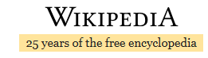
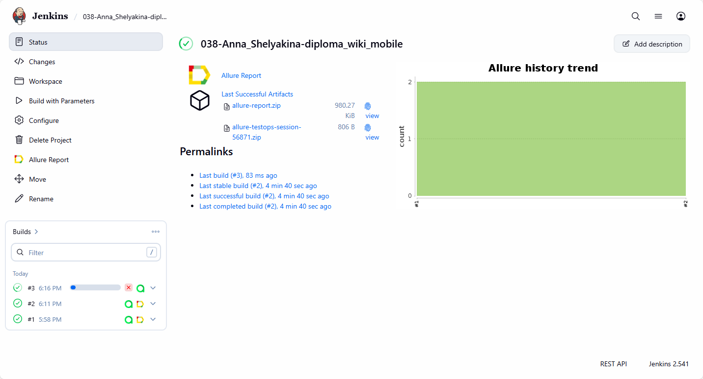
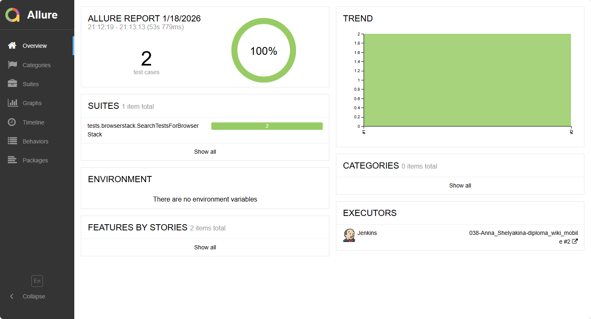
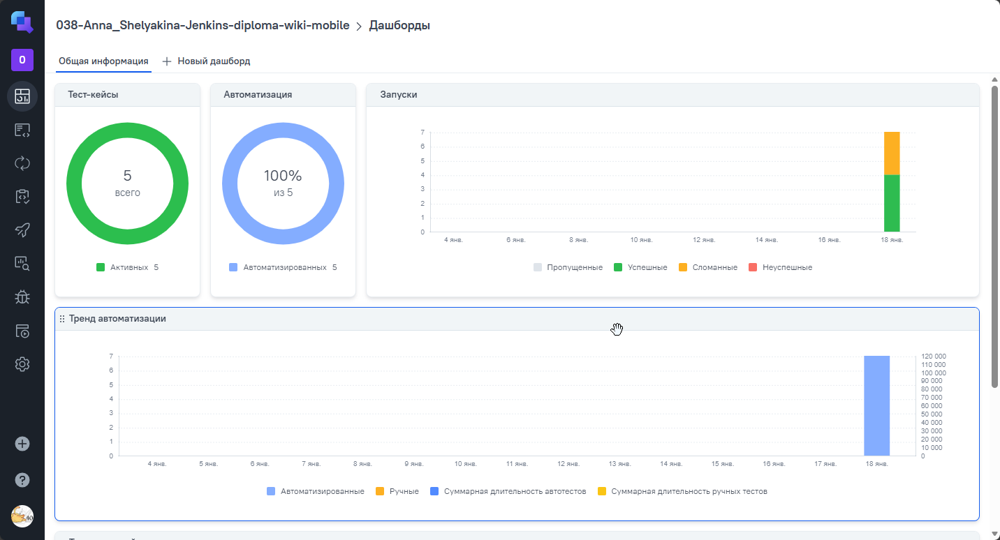
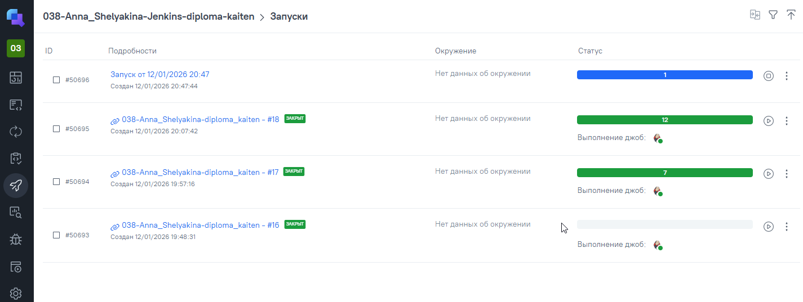

### Ниже представлен проект автоматизированного тестирования мобильной платформы Wikipedia, реализованного с применением mobile-тестов.
#### Немоного о самой платформе:
<p align="center"> 

</p>

  [Wikipedia](https://www.wikipedia.org/) — свободная онлайн-энциклопедия, созданная усилиями добровольцев со всего мира. Она доступна на множестве языков и позволяет пользователям редактировать и дополнять статьи, обеспечивая открытость и доступность информации. Содержит огромное количество статей практически по любым темам, от науки и культуры до истории и технологий. Основана на принципах коллективного творчества и постоянно обновляется сообществом участников.


## :scroll: Содержание:

- [Используемый стек](#computer-используемый-стек)
- [Запуск автотестов](#-запуск-автотестов)
- [Сборка в Jenkins](#-сборка-в-jenkins)
- [Пример Allure Report](#-пример-allure-отчета)
- [Интеграция с Allure TestOps](#-интеграция-с-allure-testOps)
- [Интеграция с Jira](#-интеграция-с-jira)
- [Уведомления в Telegram](#-уведомления-в-telegram)
- [Видео примера запуска тестов в Selenoid](#-видео-примера-запуска-теста-в-selenoid)

## :computer: Используемый стек

<p align="center"> 
<a href="https://www.jetbrains.com/idea/"></a> 
<a href="https://www.java.com/"></a>
<a href="https://selenide.org/"></a>
<a href="https://github.com/allure-framework/allure2"></a>
<a href="https://qameta.io/"></a>
<a href="https://gradle.org/"></a>
<a href="https://junit.org/junit5/"></a>
<a href="https://github.com/"></a>
<a href="https://www.jenkins.io/"></a>
<a href="https://web.telegram.org/"></a>
<a href="https://www.atlassian.com/software/jira/"></a>
</p>

#### Для работы с тестами в данном проекте используются: 
* язык - <code>Java</code>;
* фреймворк для тестирования - <code>Selenide</code>;
* сборщик - <code>Gradle</code>; 
* фреймворк модульного тестирования - <code>JUnit 5</code>;
* джоба для удалённого запуска в - <code>Jenkins</code>;
* отчёт в <code>Allure Report</code>;
* отправка результатов при помощи бота в - <code>Telegram</code>;
* интеграция с - <code>Allure TestOps</code>;
* регистрация задач и дефектов в <code>Jira</code>.

#### Содержание Allure-отчёта для mobile теста:
* Шаги теста;
* Page Source;
* Видео выполнения автотеста.

## Запуск автотестов

### Запуск mobile тестов из терминала IDEA
```
gradle clean build browserstack -DdeviceHost=browserstack
gradle clean build emulation -DdeviceHost=emulation
gradle clean build real -DdeviceHost=real
```
##  [Сборка в Jenkins](https://jenkins.autotests.cloud/job/038-Anna_Shelyakina-diploma_wiki_mobile/)


Для запуска сборки необходимо перейти в раздел <code>Собрать с параметрами</code>, выбрать значение для таких параметров как: ENVIRONMENT, COMMENT, TASK. Далее нажать кнопку <code>Собрать</code>.
<p align="center">

</p>
После выполнения сборки, в блоке <code>История сборок</code> напротив номера сборки появятся значки <code>Allure Report</code> и <code>Allure TestOps</code>, при клике на которые откроется страница с сформированным html-отчетом и тестовой документацией соответственно.

##  [Allure отчет](https://jenkins.autotests.cloud/job/038-Anna_Shelyakina-diploma_wiki_mobile/2/allure/)
### Overview

<p align="center">

</p>

##  [Интеграция с Allure TestOps](https://allure.autotests.cloud/project/5070/dashboards)


На *Dashboard* в <code>Allure TestOps</code> видна статистика по тестам: сколько ручных и автоматизированных тестов, результаты прогона при каждом запуске сборки.

<p align="center">

</p>

### Результат выполнения автотеста

<p align="center">

</p>

##  [Интеграция с Jira](https://jira.autotests.cloud/browse/HOMEWORK-1538)


Реализована интеграция <code>Allure TestOps</code> с <code>Jira</code>, в тикете отображается, какие тест-кейсы были связаны с задачей и результат их прогона.

<p align="center">

</p>

###  Уведомления в Telegram с использованием бота

После завершения сборки специальный бот, созданный в <code>Telegram</code>, автоматически обрабатывает и отправляет сообщение с отчетом о прогоне тестов.

<p align="center">

</p>

###  Видео примера запуска тестов в Selenoid

В отчетах Allure для каждого теста прикреплен не только скриншот, но и видео прохождения теста
<p align="center">
  
</p>
